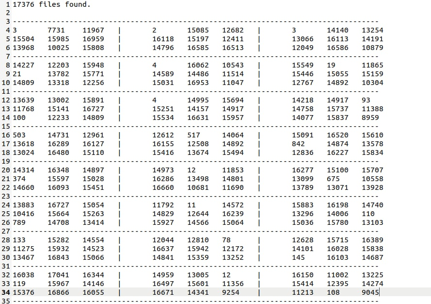

  <h1>Counter Of Matrix Zeros</h1>
   

<a href="https://github.com/HamidMolareza/SmallProjects/issues/new?assignees=&labels=bug&template=01_BUG_REPORT.md&title=bug%3A+">Report a Bug</a>
·
<a href="https://github.com/HamidMolareza/SmallProjects/issues/new?assignees=&labels=enhancement&template=02_FEATURE_REQUEST.md&title=feat%3A+">Request a Feature</a>
.
<a href="https://github.com/HamidMolareza/SmallProjects/issues/new?assignees=&labels=question&template=04_SUPPORT_QUESTION.md&title=support%3A+">Ask a Question</a>

 

## Problem
We have a lot of files. We have 23 lines in each file. There are 3, 3x3 matrices in each line. Matrix numbers are 0, 1 or -1.

We want to check all the files and see how many aij is zero in these files. `i` represents the row number of the matrix and `j` represents the column number of each matrix.

### Demo
Example of an answer:

Screenshots

In the picture you can see 8 lines of 23 lines.
 

### Built With

C# - Dotnet 6

## How Run

1. Install dotnet 6 SDK
2. Clone this project
3. `cd` to this directory
4. `dotnet build`
5. `dotnet run --project CounterOfMatrixZeros/CounterOfMatrixZeros.csproj`

## Features

- This program support `config.json` file for config program. 

## Support

Reach out to the maintainer at one of the following places:

- [GitHub issues](https://github.com/HamidMolareza/SmallProjects/issues/new?assignees=&labels=question&template=04_SUPPORT_QUESTION.md&title=support%3A+)

## Project assistance

If you want to say **thank you** or/and support active development of this project:

- Add a [GitHub Star](https://github.com/HamidMolareza/SmallProjects) to the project.  🌟

## License

See [LICENSE](../LICENSE) for more information.

