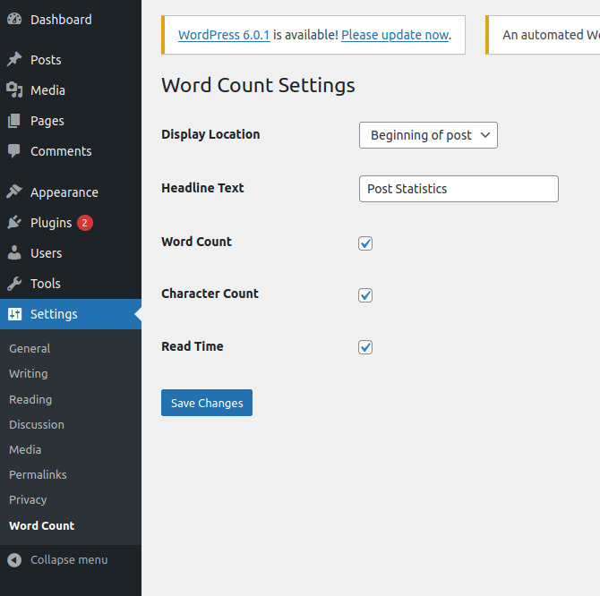

  <h1>Wordpress Plugin - Word Counter</h1>
   

<a href="https://github.com/HamidMolareza/SmallProjects/issues/new?assignees=&labels=bug&template=01_BUG_REPORT.md&title=bug%3A+">Report a Bug</a>
·
<a href="https://github.com/HamidMolareza/SmallProjects/issues/new?assignees=&labels=enhancement&template=02_FEATURE_REQUEST.md&title=feat%3A+">Request a Feature</a>
.
<a href="https://github.com/HamidMolareza/SmallProjects/issues/new?assignees=&labels=question&template=04_SUPPORT_QUESTION.md&title=support%3A+">Ask a Question</a>

 

## About

A plugin for [WordPress](https://wordpress.org) that adds information to each post. Information such as:
- The number of words
- The number of characters
- Estimated reading of any text.

These fields is displayed can be changed in the settings page. It is also possible to choose whether this information is displayed at the top of the post or at the end of the post. This information is stored in the database.

> This project was just a practice project.

### Demo

Screenshots

Setting Page:

Sample Post:

### Built With

PHP v7.5

## How Run

1. Copy plugin directory to wordpress-directory/wp-content/plugins
2. Open your site admin panel (site.com/wp-admin)
3. Go to plugins section
4. Active plugin
5. Go to `Settings` -> `Word Count` section
6. Update settings
7. Go to any post you want and see result

## Support

Reach out to the maintainer at one of the following places:

- [GitHub issues](https://github.com/HamidMolareza/SmallProjects/issues/new?assignees=&labels=question&template=04_SUPPORT_QUESTION.md&title=support%3A+)

## Project assistance

If you want to say **thank you** or/and support active development of this project:

- Add a [GitHub Star](https://github.com/HamidMolareza/SmallProjects) to the project.  🌟

## License

See [LICENSE](../LICENSE) for more information.

