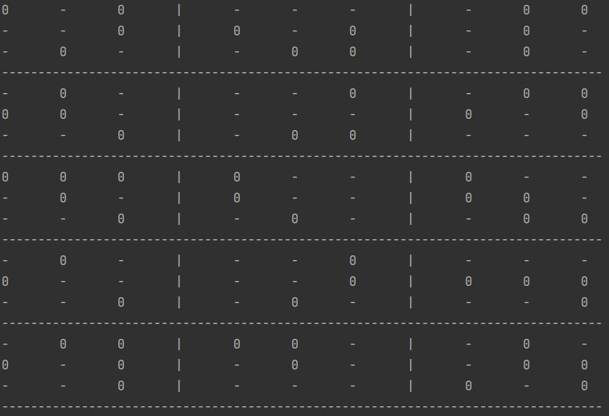

  <h1>Mathematics Problem</h1>
   

  <a href="https://github.com/HamidMolareza/SmallProjects/issues/new?assignees=&labels=bug&template=01_BUG_REPORT.md&title=bug%3A+">Report a Bug</a>
  ·
  <a href="https://github.com/HamidMolareza/SmallProjects/issues/new?assignees=&labels=enhancement&template=02_FEATURE_REQUEST.md&title=feat%3A+">Request a Feature</a>
  .
  <a href="https://github.com/HamidMolareza/SmallProjects/issues/new?assignees=&labels=question&template=04_SUPPORT_QUESTION.md&title=support%3A+">Ask a Question</a>

 

## Problem
randomly set half of the terms α(ι)i1,i2 B(ι)j1,j2 γ(ι)k1,k2 with i2 ≠ j1 and j2 ≠ k1 and k2 ≠ i1 to zero.

### Description
In each line (l) we have 3 matrices named `alpha`, `beta` and `gama`. We show `alpha` rows with i1 index and `alpha` columns with i2 index. Similarly, we have j1j2 for `beta` and k1k2 for gama.

1) We need to find cells that have the following conditions:

`i2 ≠ j1 and j2 ≠ k1 and k2 ≠ i1`

2) We find half of the available modes in 23 lines (each line contains 3 matrices) **randomly**.

3) We set the found cells value to `0` and display the rest of the cells with `-`.

### Demo
Example of an answer:

Screenshots

In the picture you can see 5 lines of 23 lines.
 

### Built With

C# - Dotnet 6

## How Run

1. Install dotnet 6 SDK
2. Clone this project
3. `cd` to this directory
4. `dotnet build`
5. `dotnet run --project Matrix/Matrix.csproj`

## Support

Reach out to the maintainer at one of the following places:

- [GitHub issues](https://github.com/HamidMolareza/SmallProjects/issues/new?assignees=&labels=question&template=04_SUPPORT_QUESTION.md&title=support%3A+)

## Project assistance

If you want to say **thank you** or/and support active development of this project:

- Add a [GitHub Star](https://github.com/HamidMolareza/SmallProjects) to the project.  🌟

## License

See [LICENSE](../LICENSE) for more information.

